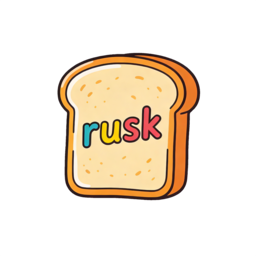

# 关于 Rusk



Rusk 是一个实验性的编程语言和运行时，用 Rust 实现。
它旨在结合：

- **类 Rust 语法**（块表达式、`match`、显式可变性控制），
- **类 TypeScript 的人体工学**（类型推断、泛型、接口驱动的抽象），以及
- **代数效应**作为控制流扩展的一等机制（异常、异步、生成器等）。

Rusk 源代码（`.rusk`）通过内部中级 IR（"MIR"）编译成紧凑的字节码模块（`.rbc`），然后由一个小型字节码虚拟机执行。该虚拟机设计为可嵌入到其他应用程序（CLI、编辑器、服务器等）中。平台集成通过嵌入环境安装的**宿主函数**提供。

## 示例

```rusk
fn main() -> int {
    let xs = [10, 20, 30];
    xs[1] = 99;
    xs[1]
}
```

## 下一步

- 入门指南：`guides/quick_start.md`
- 语言概述：`guides/concepts_and_syntax.md`
- 嵌入虚拟机：`embedding-vm.md`
- 编辑器集成 (LSP)：`rusk-lsp.md`
- 规范：
  - `../RUSK_SPEC.md`
  - `../MIR_SPEC.md`
  - `../BYTECODE_SPEC.md`
